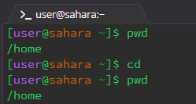
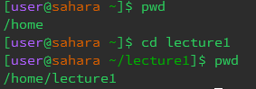
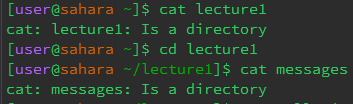

#  **Lab Report 1**
<<<<<<< HEAD
#### <u>1. `cd` - no arguments
=======
#### 1. `cd` - no arguments
>>>>>>> 3b1eb40d57f4a9436bc867417faef1b33f8b51b7
  
1. Working Directory: `/home`
2. Explanation:  The `cd` command changes directory to the given argument and gives no output. Therefore, with  the lack of arguments provided, there was no output and no directory to be changed to.
3. Error: No error occured.

<<<<<<< HEAD
#### <u>2. `cd` - directory
=======
#### 2. `cd` - directory
>>>>>>> 3b1eb40d57f4a9436bc867417faef1b33f8b51b7
  
1. Working Directory: `/home`
2. Explanation: No output was given since the `cd` command does not have an output. However, the working directory was changed to the argument given `lecture1`.
3. Error: No error occured.

<<<<<<< HEAD
#### <u>3. `cd` - file
=======
#### 3. `cd` - file
>>>>>>> 3b1eb40d57f4a9436bc867417faef1b33f8b51b7
  
<<<<<<< HEAD
1. Working Directory: `/home/lecture1`
2. Explanation: An output was given because the argument given (a file) does not comply with what `cd` does,changing directories.
3. Error: An error was given stating that `Hello.java` was not a directory and the working directory was not changed.
  
---
=======
1. Working Directory: `/home/lecture1`
2. Explanation: An output was given because the argument given (a file) does not comply with what `cd` does,changing directories.
3. Error: An error was given stating that `Hello.java` was not a directory and the working directory was not changed.
>>>>>>> 3b1eb40d57f4a9436bc867417faef1b33f8b51b7

<<<<<<< HEAD
#### <u>4. `ls` - no arguments
=======
***

#### 4. `ls` - no arguments
>>>>>>> 3b1eb40d57f4a9436bc867417faef1b33f8b51b7
  
1. Working Directory: `/home`
2. Explanation: The `ls` command with no arguments gave an output of the names of the files and folders inside the current working directory. 
3. Error: No error occured.

<<<<<<< HEAD
#### <u>5. `ls` - directory
=======
#### 5. `ls` - directory
>>>>>>> 3b1eb40d57f4a9436bc867417faef1b33f8b51b7
  
1. Working Directory: `/home`
2. Explanation: The `ls` command with a directory argument listed the files and folders within that given directory. Although still in the `/home` directory, this command listed what was inside the `lecture1`directory, without changing the current directory.
3. Error: No error occured.

<<<<<<< HEAD
#### <u>6. `ls` - file
  
1. Working Directory: `/home`
2. Explanation: `ls` can view the subfiles/folders of the current working directory and the content of folders or files within the pd, but not further.
3. Error: An error occured. Despite the `Hello.java` file existing, the `ls` command can not see the file as the current working directory is `/home` while `Hello.java` is in `/home/lecture1`.
  
---
=======
#### 6. `ls` - file
  
1. Working Directory: `/home`
2. Explanation: `ls` can view the subfiles/folders of the current working directory and the content of folders or files within the working directory, but not further.
3. Error: An error occured. Despite the `Hello.java` file existing, the `ls` command can not see the file as the current working directory is `/home` while `Hello.java` is in `/home/lecture1`.
>>>>>>> 3b1eb40d57f4a9436bc867417faef1b33f8b51b7

***

<<<<<<< HEAD
#### <u>7. `cat` - no arguments
=======
#### 7. `cat` - no arguments
>>>>>>> 3b1eb40d57f4a9436bc867417faef1b33f8b51b7
  
1. Working Directory: `/home`
2. Explanation: Executing the `cat` command with no argument produced no output but did change the terminal. The terminal waited for a user-input, with directory or file names not performing anything. Using `crtl+c` ended this seemingly endless loop.
3. Error: No error occured.

<<<<<<< HEAD
#### <u>8. `cat` - directory
=======
#### 8. `cat` - directory
>>>>>>> 3b1eb40d57f4a9436bc867417faef1b33f8b51b7
  
<<<<<<< HEAD
1. Working Directory: `/home` & `/home/lecture1`
2. Explanation: Cat can not be used directly on folders.
3. Error: An error occured. Using `cat` with a directory produced an error stating that the chosen argument is a directory. Therefore, cat can not be used on directories.
=======
1. Working Directory: `/home` & `/home/lecture1`
2. Explanation: Cat can not be used directly on folders.
3. Error: An error occured. Using `cat` with a directory produced an error stating that the chosen argument is a directory. Therefore, `cat` can not be used on directories.
>>>>>>> 3b1eb40d57f4a9436bc867417faef1b33f8b51b7

<<<<<<< HEAD
#### <u>9. `cat` - file
=======
#### 9. `cat` - file
>>>>>>> 3b1eb40d57f4a9436bc867417faef1b33f8b51b7
  
<<<<<<< HEAD
1. Working Directory: `/home/lecture1`
2. Explanation: Executing `cat` with a file argument outputted the code written within the file. Importantly, the current working directory had to contain the file and couldn't be a parent folder.
3. Error: No error occured.
=======
1. Working Directory: `/home/lecture1`
2. Explanation: Executing `cat` with a file argument outputted the code written within the file. Importantly, the current working directory had to contain the file and couldn't be a parent folder.
3. Error: No error occured.

>>>>>>> 3b1eb40d57f4a9436bc867417faef1b33f8b51b7