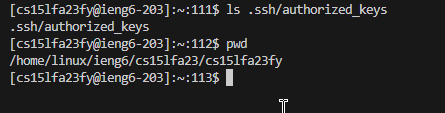

#  **Lab Report 2**
## Part 1.
### `StringServer` Code:  
  

***

### `/add-message` Examples:  
#### Example 1:  
  
1. Methods  
`handleRequest` in class `Handler`. Implements the behavior of the local server. 

2. Arguments:  
    - `string`: Contains the full string to be printed on the website. Initialized as the empty string.
    - `increment`: Contains the current int to be displayed per line. Initialized as 1. 
    - `url`: The argument passed into the method, a URI that contains the user-input as a path.  

3. Value Changes:  
    - `string`: Changes from `"1. Hello\n"` to `"1. Hello\n2. World\n"`.
    - `increment`: Changes from `2` to `3`.
    - `url`: Changes from a previous input to `/add-message?s=World`.  

#### Example 2:  
  
1. Methods  
`handleRequest` in class `Handler`. Implements the behavior of the local server. 

2. Arguments:  
    - `string`: Contains the full string to be printed on the website. Initialized as the empty string.
    - `increment`: Contains the current int to be displayed per line. Initialized as 1. 
    - `url`: The argument passed into the method, a URI that contains the user-input as a path.  

3. Value Changes:  
    - `string`: Changes from `"1. Hello\n2. World\n..."` to `"...12. Still Working...\n"`.
    - `increment`: Changes from `12` to `13`.
    - `url`: Changes from a previous input to `/add-message?s=Still working...`.  

***
#### A note on `StringServer` class
1. Methods  
`main` in class `StringServer`. Initiates the server.  

2. Arguments:  
    - `args`: A string array inputted by the user from the terminal.
    - `port`: An int value referring the first string of args (an input by the user).  

3. Value Changes:  
    - `args`: Does not change as the server has already been started from the terminal.
    - `port`: Does not change as it was already decided by the user when the server started.  

 
 

## Part 2.
### 1. Private key  
  
The private key is stored in `/.ssh/id_rsa`, with my default terminal being `/c/Users/fmfra`.

### 2. Public key  
  
The public key is stored in `/.ssh/authorized_keys`, with the ieng6 default terminal being `/home/linux/ieng6/cs15lfa23/cs15lfa23fy`.

### 2. No-password  
  

 

## Part 3.

The biggest thing I learned from the last 2 labs is the idea of remote log-in and SSH. I had no idea what SSH meant or how to use it prior. I now understand how remote connections are formed through network access. Also, the idea that when I connect to ieng6, I am simply connecting to a computer like my own that is running a server to be connnected to. I am able to git clone files into this remote connection, for example, and essentially function as if it were on the computer in front of me. I also enjoyed how we connected paths to browsers (url's) which gave a lot more meaning to how we use 'browser paths' in our everyday usage. 

I also have learned a lot of new markdown techniques and tools that I didn't know when writing lab report 1. I am still learning a lot and enjoy all the little changes I am able to make with markdown.