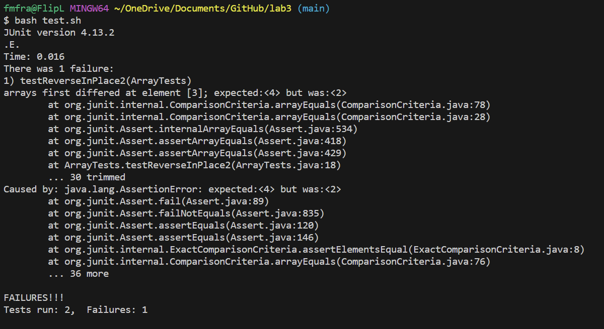

#  **Lab Report 3**

## Part 1 Bug: `reverseInPlace` method for `ArrayExamples.java` <br>


### Failure-Inducing Input:
```
@Test
public void testReverseInPlace() {
    int[] input1 = { 5, 4, 3, 2, 1 };
    ArrayExamples.reverseInPlace(input1);
    assertArrayEquals(new int[]{ 1, 2, 3, 4, 5 }, input1);
}
```
```
There was 1 failure:
1) testReverseInPlace1(ArrayTests)
arrays first differed at element [3]; expected:<4> but was:<2>
        at org.junit.internal.ComparisonCriteria.arrayEquals(ComparisonCriteria.java:78)
        at org.junit.internal.ComparisonCriteria.arrayEquals(ComparisonCriteria.java:28)
        at org.junit.Assert.internalArrayEquals(Assert.java:534)
        at org.junit.Assert.assertArrayEquals(Assert.java:418)
        at org.junit.Assert.assertArrayEquals(Assert.java:429)
        at ArrayTests.testReverseInPlace2(ArrayTests.java:18)
        ... 30 trimmed
Caused by: java.lang.AssertionError: expected:<4> but was:<2>
        at org.junit.Assert.fail(Assert.java:89)
        at org.junit.Assert.failNotEquals(Assert.java:835)
        at org.junit.Assert.assertEquals(Assert.java:120)
        at org.junit.Assert.assertEquals(Assert.java:146)
        at org.junit.internal.ExactComparisonCriteria.assertElementsEqual(ExactComparisonCriteria.java:8)
        at org.junit.internal.ComparisonCriteria.arrayEquals(ComparisonCriteria.java:76)
        ... 36 more
```


### Non Failure-Inducing Input:
```
@Test 
public void testReverseInPlace() {
    int[] input1 = { 3 };
    ArrayExamples.reverseInPlace(input1);
    assertArrayEquals(new int[]{ 3 }, input1);
} 
```
```
OK (1 test)
```


### Symptom:
 <br>


### Bug:
Before:
```
static void reverseInPlace(int[] arr) {
    for(int i = 0; i < arr.length; i += 1) {
      arr[i] = arr[arr.length - i - 1];
    }
}
```
After:
```
static void reverseInPlac(int[] arr) {
    for(int i = 0; i < arr.length / 2; i += 1) {
        int tempVar = arr[arr.length - i - 1];
        arr[arr.length - i - 1] = arr[i];
        arr[i] = tempVar;
    }
}
```
The bug in the code is that when the end elements of the array would be swapped to the beginning, the end elements would then be swapped with themselves in the initial indices, so the 2nd half of the array stayed the same. I fixed this bug by storing each element on the opposite side of the array of the current element in a variable named tempVar, then overwriting that opposing element with the current element, and finally overwriting the current element with the opposing element in tempVar. In addition, I made the for loop to I < arr.length / 2, making the loop only run for half the array as the 2nd half was already solved.

<br>

## Part 2: `grep` command

### 1. `-w`
```
$ grep -w "yes" technical/government/Alcohol_Problems/*

technical/government/Alcohol_Problems/Session2-PDF.txt:a screen for alcohol abuse and dependence, has 24 yes/no questions.
technical/government/Alcohol_Problems/Session2-PDF.txt:has 35 yes/no questions. While lengthy, the SAAST has the advantage
technical/government/Alcohol_Problems/Session2-PDF.txt:improve efficiency.35 If one question answered "yes" yields a
```
```
$ grep -w "happy" technical/plos/*

technical/plos/journal.pbio.0020140.txt:        mood of two people presented in a pair and, as much as possible, to select the ‘happy’
technical/plos/journal.pbio.0020140.txt:        person, who would then smile. Over time, the person with the ‘happy’ mood (who would smile
technical/plos/journal.pbio.0020164.txt:        happy—would not cross the scientific mind. Yet in biology we often pose “why” questions in
technical/plos/journal.pbio.0020262.txt:        are happy to be called dwarfs or little people, but midget is no longer an acceptable term.
technical/plos/journal.pbio.0030129.txt:        identities, we are happy to cooperate, subject to the permission of the reviewers. This can
technical/plos/pmed.0020118.txt:        medical schools may not be producing doctors who are happy with the profession, or who fit
technical/plos/pmed.0020158.txt:        reports and their identities, we are happy to cooperate, subject to the permission of the
technical/plos/pmed.0020203.txt:        important study at this interface between biology and medicine, and will be happy to talk
technical/plos/pmed.0020209.txt:            an entire institution whose mission is to approve drugs and make industry happy.”
```
This command option only prints/finds lines when the pattern is by itself, or within other syntax like parentheses and quotations. In other words, it does not list lines that contain words that contain the pattern. In this case, lines with words like "unhappy" would not be found. This is useful when searching for a word that is often found in other words, such as "is", and you only want that exact word. 

Source: [https://www.geeksforgeeks.org/grep-command-in-unixlinux](https://www.geeksforgeeks.org/grep-command-in-unixlinux)


### 2. `-1`
```
$ grep -1 "singular" technical/plos/*

technical/plos/journal.pbio.0020394.txt-        special role in the organisation of smooth, precise, well-timed, and task-sensitive motor
technical/plos/journal.pbio.0020394.txt:        output) would be quick to point out, the singular role for the cortex in such graceful
technical/plos/journal.pbio.0020394.txt-        behaviour is rather questionable.
```
```
$ grep -1 "crazy" technical/biomed/*

technical/biomed/1472-6882-1-10.txt-          puncheon rum (80% proof), it is claimed that the dog may
technical/biomed/1472-6882-1-10.txt:          become temporarily crazy. Based on experiences like
technical/biomed/1472-6882-1-10.txt-          these, some hunters have switched from alcohol to olive
```
This command option will list 1 line before and after the line containing the pattern. Moreover, increasing the number will add more lines of context, so -2 will add 2 lines before and after the line with the pattern. This is very useful when you want context for when the pattern phrase is said, rather than just finding 1 specific line.

Source: `grep --help`


### 3. `-c`
```
$ grep -c "and" technical/government/Alcohol_Problems/*

technical/government/Alcohol_Problems/DraftRecom-PDF.txt:130
technical/government/Alcohol_Problems/Session2-PDF.txt:139
technical/government/Alcohol_Problems/Session3-PDF.txt:437
technical/government/Alcohol_Problems/Session4-PDF.txt:313
```
```
$ grep -c "supercalifragilisticexpialidocious" technical/government/Alcohol_Problems/*

technical/government/Alcohol_Problems/DraftRecom-PDF.txt:0
technical/government/Alcohol_Problems/Session2-PDF.txt:0
technical/government/Alcohol_Problems/Session3-PDF.txt:0
technical/government/Alcohol_Problems/Session4-PDF.txt:0
```
This option prints each file and a count of the number of lines that match the given number. This could be useful if you just want to find how many lines contain the given string, but don't need to see those lines or want to avoid clutter. For a common phrase like "and", seeing every single instance of the string could be overwhelming, making this command useful.

Source: [https://www.geeksforgeeks.org/grep-command-in-unixlinux](https://www.geeksforgeeks.org/grep-command-in-unixlinux)


### 4. `n`
```
$ grep -n "beauty" technical/plos/*

technical/plos/journal.pbio.0020053.txt:206:        Strep . The beauty of these enzymes is that they are targeted
technical/plos/journal.pbio.0020262.txt:54:        This being television, the series closes with a discussion of beauty, which Leroi
technical/plos/journal.pbio.0020262.txt:58:        influenced by culture, and it is hard to take this interpretation of beauty as an adequate
```
```
$ grep -n "cell proliferation" technical/plos/*

technical/plos/pmed.0010061.txt:92:        [18]. Conversely, leptin stimulates cytokine activation and immune-cell proliferation, an
technical/plos/pmed.0020074.txt:10:        cell proliferation, i.e., whether and how fast cells divide. Abnormally active kinases
technical/plos/pmed.0020160.txt:10:        cell dysfunction, and foam cell proliferation in the tunica media [1,2]. Smoking also
technical/plos/pmed.0020161.txt:240:        cell proliferation and cell selection. There were no obvious differences in marker and
technical/plos/pmed.0020273.txt:41:        three major groups: immune and inflammatory response; oncogenesis, cell proliferation, and
```
This command option functions very similar to the default option, but will also add the line number at which the pattern was found. This is useful when you wish to locate that line in the file itself after using `grep`, rather than just knowing it exists in the file somewhere.

Source: [https://www.geeksforgeeks.org/grep-command-in-unixlinux](https://www.geeksforgeeks.org/grep-command-in-unixlinux) 
