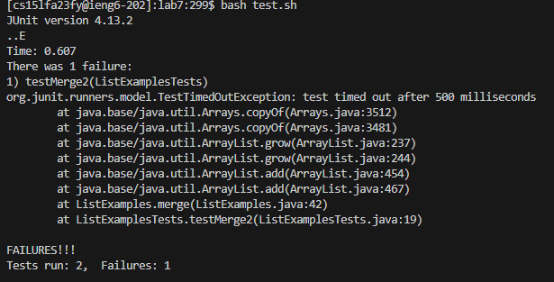
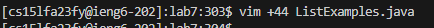
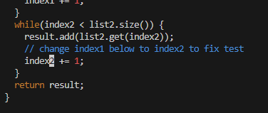
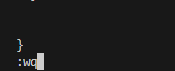
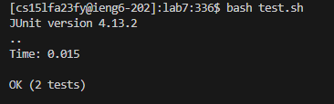
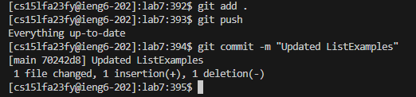

#  **Lab Report 4**

### Step 4: Log into ieng6
  
Since we use this command so often in this class, I have memorized it and just write it out each time. We did make a bash file to run it for us before, however I find it takes more time to find that file than just write it out each time. If I already used it within this terminal I also tend to used `up up` through history or `crtl-R ssh` to find it.  

So, I wrote out `ssh <SPACE> cs15lfa23fy@ieng6.ucsd.edu <enter>` which connects me to the ieng6 servers.

  

### Step 5: Clone your fork of the repository from your Github account
  

Not shown was me pressing `<ctrl + c>` of the ssh URL from the github fork of the repository in order to copy it.

From within the ieng6 server, I typed out `git clone <SPACE>` and then `<ctrl + v> <enter>` in order to clone the forked repository into the ieng6 server. 

Then `ls <enter>` to see the file structure of the ieng6 directory. Then `cd <space> lab7 <enter>` in order to change my directory to the cloned `lab7` folder. Finally `ls <enter>` again to make sure I was in the right directory.

  

### Step 6: Run the tests, demonstrating that they fail
  

`bash <space> test.sh <enter>` in order to run the bash script `test.sh`, which contains the command line arguments needed to compile and run `ListExamplesTests` using Junit.

  

### Step 7: Edit the code file to fix the failing test
  

`vim <space> +44 <space> L <tab> . <tab> <enter>` in order to access the vim editor for the file `ListExamples.java` on line 44 (the line containing the bug). 

  

`<ctrl + a>` to jump to the first integer on the current line and then increment the value of that int by 1. This changes the line from `index1 += 1;` to `index2 += 1;`, which fixes the bug within the file.

  

`:wq <enter>` to save and exit the vim editor 

  

### Step 8: Run the tests, demonstrating that they now succeed
  

`bash <space> test.sh <enter>` to again run the bash script `test.sh`, which contains the command line arguments needed to compile and run `ListExamplesTests` using Junit.

  

### Step 9: Commit and push the resulting change to your Github account
  

`git <space> add <space> . <enter>` to add all changes made to the git queue. 

`git <space> push <enter>` to push the added changes from the local repository to a remote repository. 

`git <space> commit <space> -m <space> "Updated ListExamples" <enter>` to commit the changes added and pushed to the actual github repository (change the code in the repo), the `-m` allows me to type the commit message from the command line instead of opening vim.