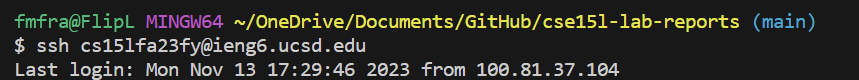
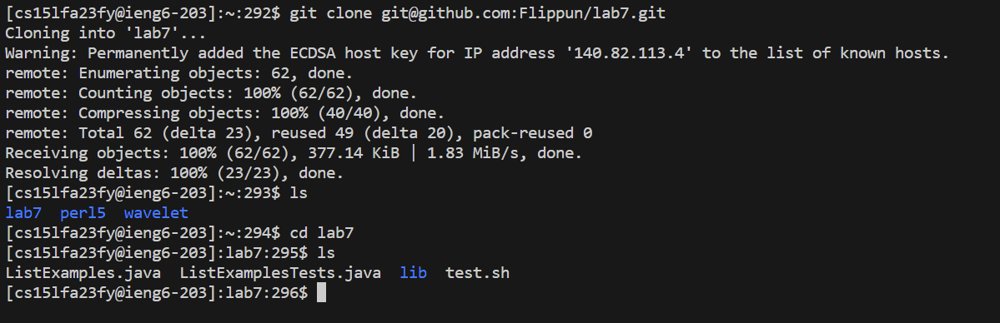

#  **Lab Report 4**

### Step 4: Log into ieng6
  
Since we use this command so often in this class, I have memorized it and just write it out each time. We did make a bash file to run it for us before, however I find it takes more time to find that file than just write it out each time. If I already used it within this terminal I also tend to used `up up` through history or `crtl-R ssh` to find it.  

So, I wrote out `ssh cse15lfa23fy@ieng6.ucsd.edu <ENTER>`

### Step 5: Clone your fork of the repository from your Github account
  

### Step 6: Run the tests, demonstrating that they fail
  

### Step 7: Edit the code file to fix the failing test
  

### Step 8: Run the tests, demonstrating that they now succeed
  

### Step 9: Commit and push the resulting change to your Github account
  

