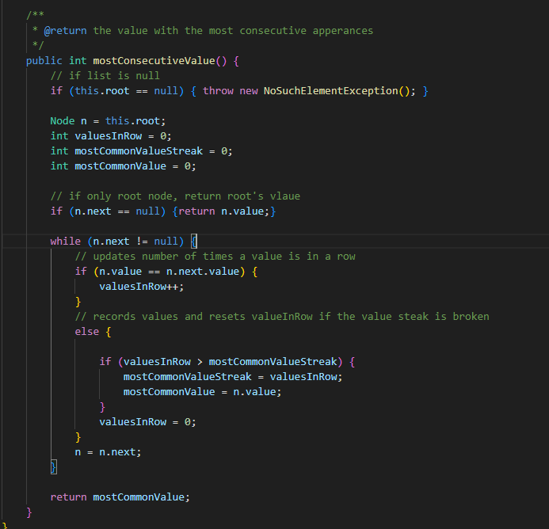
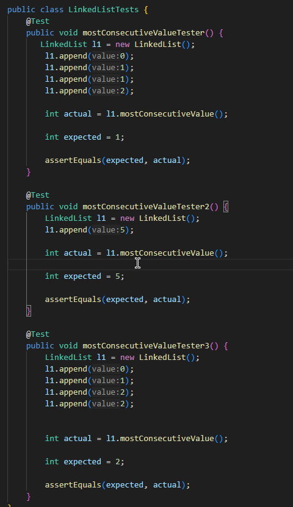
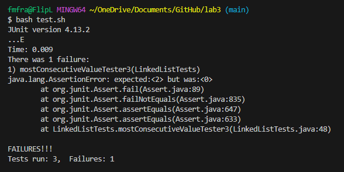
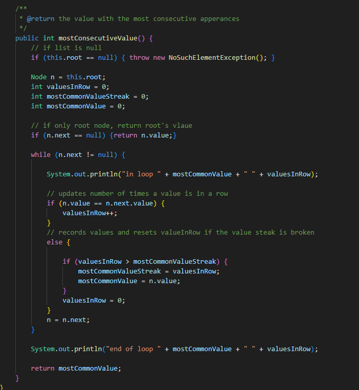
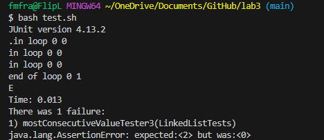
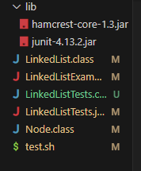
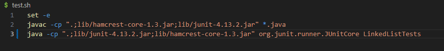
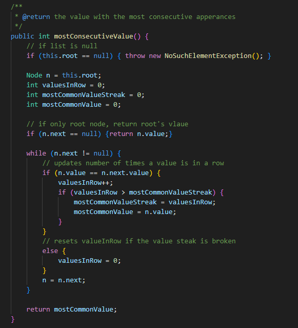
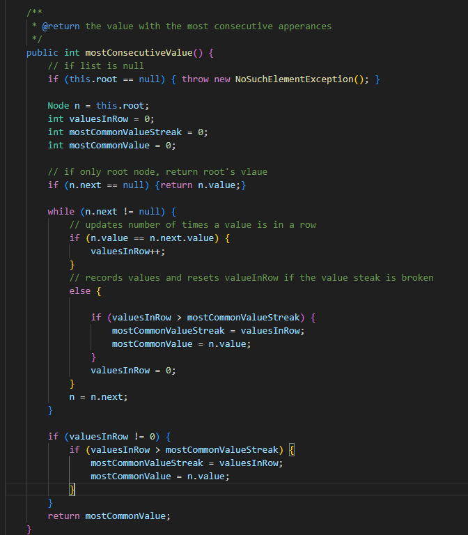

#  **Lab Report 5**

## Part 1 -

### Orginal Post

Hello, I was designing some code to find the value that occurs the most in a row in a linked list (ex. 2 in the LL with values: 1-2-2-3). I have written some code for this within the corrected LinkedList implementation of Lab3, but am facing an error for some of my tests. These tests are written in a seperate file and I am using Junit and a bash script to test the code, but I don't think that's the error. Most of my tests run fine but it seems whenever the value with the most consecutive appearances is at the end of the list, something within my code breaks and I don't get the expected output. I can't quite figure out why this specific edge case is happening. Could you look at my code and offer any help? I included some screenshots.

  

### TA Response
Hi! I think you are on to something with your 3rd test. Maybe think of some ways you can track and view your variables, such as the mostCommonValueStreak and mostCommonValue throughout the code, perhaps even during each iteration of the while loop? It could also be beneficial to consider how and if/else statement executes (does only one code body run? both?), and apply this knowledge to how your variables are updating during your 3rd test.

  

### Student Fix
Using the TA's suggestion, the student implemented print statements during and after the while loop to track variables.

  

Using the same junit bash script, and just focusing on the prints:

  

From this, the student can see that mostCommonValue is not updated when the loop ends, despite valuesInRow having been updated to 1 successfully. From this, and the TA's push to consider the order of if/else loops, the bug for this edge case can be found and understood.
  

### Full Bug Description
The code does not address the edge case in which the most consecutive value is at the end of the linked list. More generally, a value streak still going when the list ends is not even considered. When n.value == n.next.value for 2nd to last and last node, the if statement is ran, causing the else statement to be skipped. Now, n.next is null as the end of the linked list has been reached, so the while loop exits and the value stored in mostCommonValue is returned. Therefore, the only way to update mostCommonValue is if the streak ends before the linked list ends, as a streak ending is the only time when mostCommonValueStreak is compared and mostCommonValue is updated.

So in the student's 3rd test, when this edge case is tested, the steak of 2's never ends and so the else body is never ran with the updated value of valuesInRow (1) and the default value of 0 for mostCommonValue is returned.

  

### Setup

#### File Structure
  
  

#### Contents With Bug

#### Failure-Inducing Input

mostConsecutiveValueTester3 is the test that induced a failure.

#### Fixed Code
There are two reasonable fixes to the student's code that don't drastically restructure how the method works.

Fix 1: Move the check for if the current streak is the longest to inside the if loop.
    

Fix 2: Add an additional check after the while loop that considers any streaks that were ongoing when the loop ends.
    

  

## Part 2 -

### Reflection
I found that writing the autograder code within bash to be extremely interesting and engaging. First off, learning bash syntax was a bit of a challenge and took some time to get used to, which made the process interesting. But mostly what intrigued me was the idea that I could reasonably create the same process that a company like gradescope uses. Obviously they use a more sophisticated implementation and have a fancy ui through a webserver, but the base idea is generally the same. I now know how to make checks for certain tests and give percentage scores out for a generalized submission base. 

I also found using jdb to cause a tiny revelation. Mainly just that the output that java or something like junit gives when an error is reached is just a more readable ui version of what I was doing with the code in lab. I think learning how these things I took for granted aren't that far beyond my understanding (at least on a simple implementation level) is really encouraging and cool to learn.