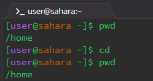
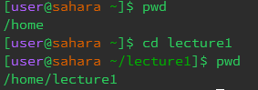
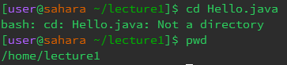
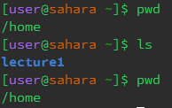
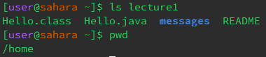
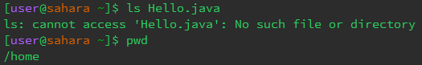
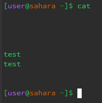
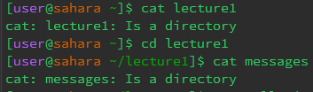
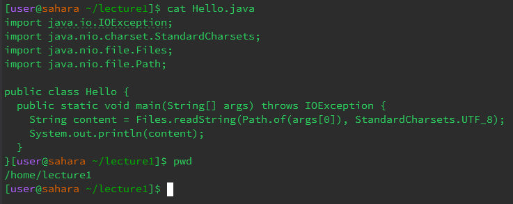

#  **Lab Report 1**
### Flip Frauenzimmer
---
#### <u>1. "cd" - no arguments
  
The "cd" command changes directory to the given argument and gives no output. Therefore, with the lack of arguments provided, there was no output and no directory to be changed to.

#### <u>2. "cd" - directory

No output was given since the cd command does not have an output. However, the working directory was changed to the argument given "lecture1".

#### <u>3. "cd" - file

An output was given because the argument given (a file) does not comply with what "cd" does, changing directories. Therefore, an error was given stating that Hello.java was "Not a directory" and the working directory was not changed.

#### <u>4. "ls" - no arguments

The "ls" command with no arguments gave an output of the names of the files and folders inside the current wd. Since the wd was /home, the only folder within it was /lecture1.

#### <u>5. "ls" - directory

The "ls" command with a directory argument listed the files and folders within that given directory. Although still in the /home directory, this command listed what was inside ther /lecture1 directory, without changing the current directory.

#### <u>6. "ls" - file

Here a limitation of the "ls" command is seen as the output produced is an error. Despite the "Hello.java" file existing, the ls command can not see the file as the current wd is /home while Hello.java is in /home/lecture1. So, "ls" can view the subfiles/folders of the current wd and the content of folders/files within the pd, but not further.

#### <u>7. "cat" - no arguments

Executing the "cat" command with no argument produced no output but did change the terminal. The terminal waited for a user-input, with directory or file names not performing anything. Using crtl+d ended this seemingly endless loop.

#### <u>8. "cat" - directory

Using cat with a directory produced an error stating that the chosen argument is a directory. Therefore, cat can not be used on directories.

#### <u>9. "cat" - file

Executing "cat" with a file argument outputted the code written within the file. Importantly, the current working directory had to contain the file and couldn't be a parent folder.
